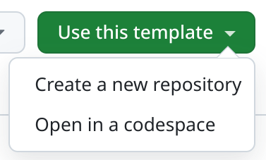
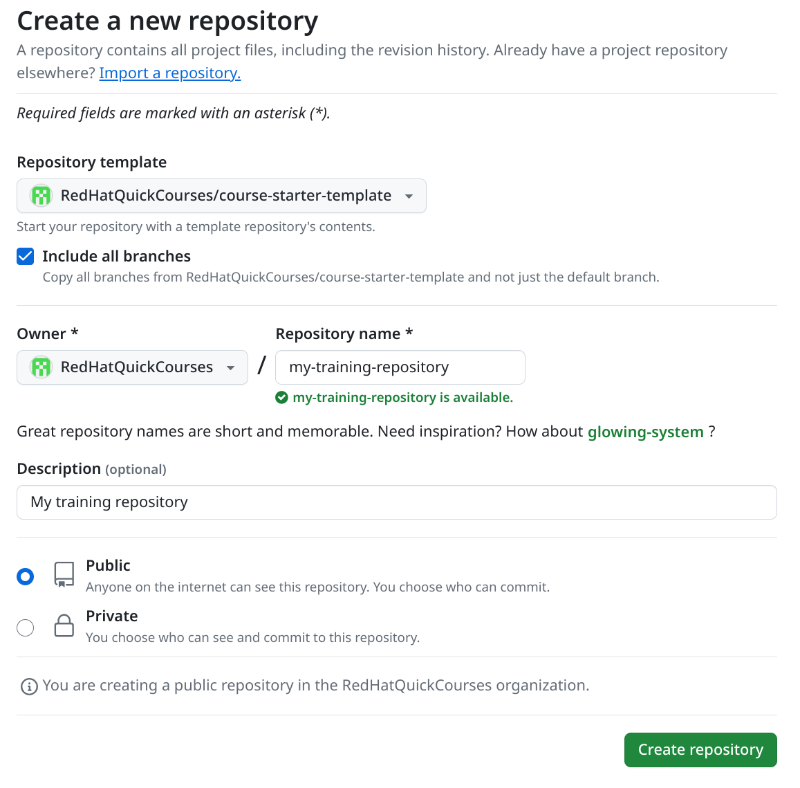
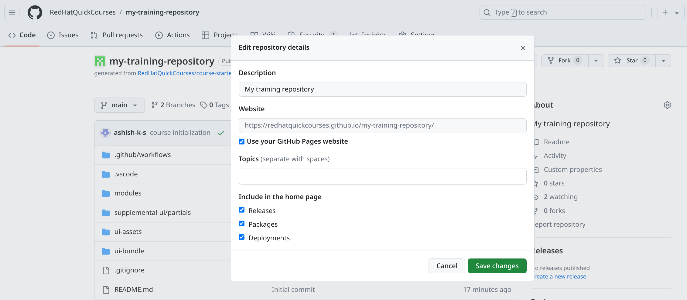
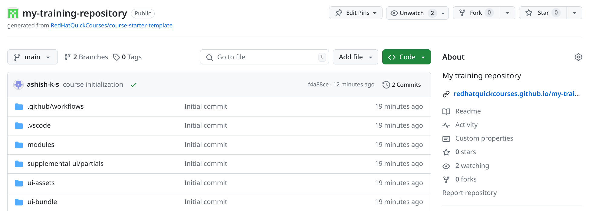

## Getting started with a new training content repository

- Open the [course-starter-template](https://github.com/RedHatQuickCourses/course-starter-template)

- Click on `Use This template` button and select `Create a new repository` option.



- On `Create a new repository` page, Select the options as highlighted in the below image and then click `Create repository` button at the bottom of the page.



- Clone this repository on your local system:
```
git clone git@github.com:RedHatQuickCourses/my-training-repository.git
```
NOTE: Use your repository url in the above command.

- Go in to the course repository directory and initialize the course.
``` 
cd my-training-repository/
sh course-init.sh --type bfx --lab demo
```
NOTE: If you are using Mac, use *zsh* in place of *sh* in the above command.

Sample output:
```
Initializing my-training-repository . . . done

Please replace the specified strings in the files below and commit the changes before proceeding with the course development.
antora.yml:title: REPLACE Course Title
```

- Edit the files prompted by course initialization script.

- Commit the changes done by course initialization script and your manual edits.
```
 git status 
 git add -A; git commit -m "course initialization"
 git push origin main 
```

- Browse your git repository url 

- On your github repo page, on left hand side pane, click on settings gear icon near `About` heading.

- Click `Use your GitHub Pages website` option to select (checked) it and then click `Save changes` button.



- You should now see the link to access the rendered content within that same block.



FIXME: highlight the relevant area on images.

**SEE ALSO**

- [Development using devspace](./DEVSPACE.md)
- [Guideline for editing your content](./USAGEGUIDE.adoc)
